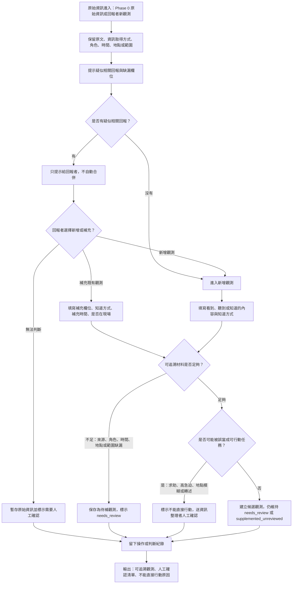

# 資訊流程設計

> 這份流程依據 `docs/decisions.md` 撰寫。Mermaid 可由 Codex 先產生草稿，但仍需要人類用 VS Code 預覽並檢查流程是否合理。

## 我的 v1 目標

- 我優先服務的使用者：回報者。
- 這個使用者最想完成的事：快速留下「我看到 / 聽到 / 知道了什麼」與「我怎麼知道的」，即使資料還不完整。
- 我最想避免的錯誤：把未確認、轉述或補充中的資訊顯示成已確認，或讓行動者誤以為可以直接出發。

## 自然語言流程描述

```text
原始資訊進入後，工作台先保留原文、資訊取得方式、回報者角色、知道時間、地點或範圍，以及主觀急迫感。

系統可以提示疑似相關回報與缺漏欄位，但只能作為輔助提示，不能自動合併回報，也不能判定資訊為真。

回報者可以選擇建立新的觀測，或補充既有觀測。補充時要說明補充的是哪個欄位、怎麼知道、何時知道、是否在現場，或是否只是轉述。

如果缺少來源方式、角色、時間、地點或範圍，仍可保存，但必須標示為需要人工確認，不能形成可行動任務。

如果內容看起來像求助、主觀急迫感高、地點模糊、角色不明，或可能是轉述，工作台要標示不能直接行動，交給資訊整理者人工確認。

如果資料足以形成候選觀測，也仍維持 needs_review 或 supplemented_unreviewed，不升級成 confirmed / verified。

每次建立、補充、暫存、標示不能直接行動或送人工確認，都要留下操作或判斷紀錄。
```

## Mermaid 流程圖



## 人工確認點

- 回報者角色是否清楚，例如當事人、現場者、家屬、志工、轉述者或不確定。
- 補充觀測是否真的能補上既有觀測，還是只是另一筆相似但不同的原始資訊。
- 疑似相關回報是否指向同一件事；系統不能自動合併。
- 主觀急迫感是否需要後續升級；它不能被當成系統優先順序。
- 地點或範圍描述是否足以讓下一位協作者理解。
- `needs_review`、`unverified`、`supplemented_unreviewed` 是否仍被清楚標示為未確認。

## 不能自動處理的分支

- 不能自動把疑似相關回報合併成同一事件。
- 不能自動把多人補充轉成可信分數或已確認狀態。
- 不能自動判斷是否可以派志工、出發或採取救災行動。
- 不能把回報者主觀急迫感轉成系統優先順序。
- 不能補真實地址、聯絡方式、人物身分或外部查核結果。
- 缺少來源、角色、時間、地點或範圍時，只能標示需要人工確認或暫存，不能硬轉成候選任務。

## 操作或判斷紀錄

- 建立新觀測：記錄操作者、建立時間、原始描述、資訊取得方式、角色與主觀急迫感。
- 補充既有觀測：記錄補充欄位、補充內容、怎麼知道、何時知道、是否在現場或只是轉述。
- 標示需要人工確認：記錄缺漏欄位與不能判斷的原因。
- 標示不能直接行動：記錄為什麼不能變成任務，例如地點模糊、轉述、角色不明或查核狀態不足。
- 暫時不採用或不合併：記錄保留理由，避免後續協作者以為資料被忽略或已被清理。

## 我檢查後修正了什麼

- 原本：流程容易從「新增觀測」直接走到「建立候選觀測」，沒有明確表示疑似相關回報不能自動合併。
- 修正後：加入「只提示給回報者，不自動合併」與「回報者選擇新增或補充」兩個節點。
- 為什麼：`docs/decisions.md` 已決定搜尋只顯示疑似相關，不能把相似文字當成同一事件；這個修正能避免 Codex 後續實作時加入自動合併。

## 我仍不確定的流程點

- 新增觀測與補充觀測是否需要一個欄位，讓回報者說明「為什麼我覺得這和既有回報相關」。
- 疑似相關提示是否會讓回報者過度修改原始描述，導致原始資訊被整理得太像系統想要的格式。
- 「主觀急迫感」是否需要更白話的選項，避免被誤解成救災優先順序。
- 下一階段是否需要把「待人工確認」拆成更細的狀態，例如待補來源、待補地點、待確認角色或待確認是否同一事件。
